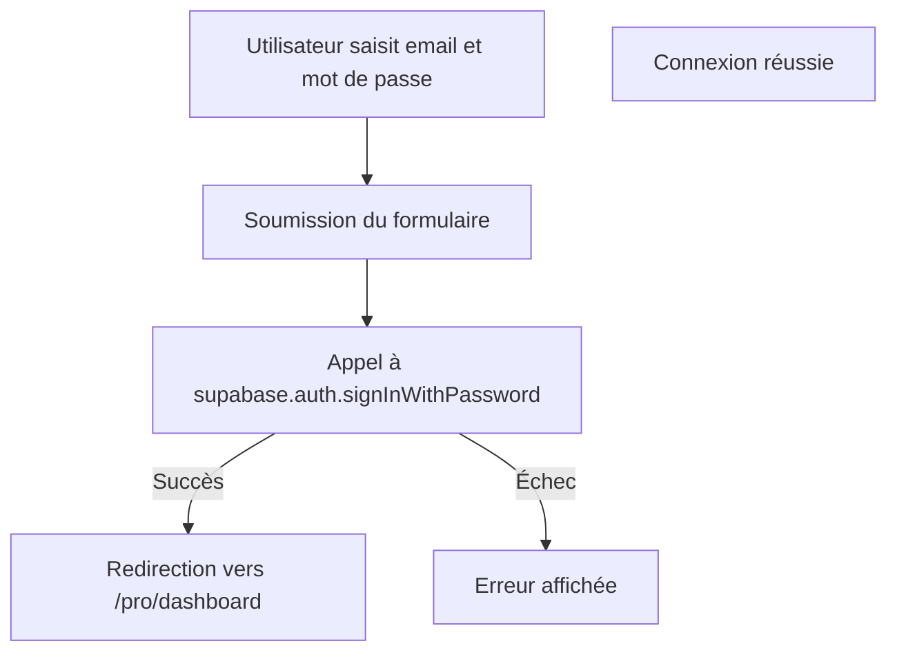

# Login Page – Documentation

Ce fichier décrit la page de connexion utilisateur.

**Fonctionnement détaillé :**
- Formulaire pour saisir email et mot de passe.
- Utilise Supabase pour authentifier l'utilisateur.
- Redirige vers `/pro/dashboard` après connexion réussie.
- Affiche les erreurs d'authentification si besoin.
- Lien vers la page d'inscription.

**Détails du code :**
- Utilise les hooks React pour gérer les états de formulaire.
- Utilise `useRouter` pour la navigation après connexion.

**Documentation technique**

## Fonctionnalité
Cette page permet à un utilisateur de se connecter à l’application à l’aide de son email et mot de passe. Elle gère la saisie du formulaire, l’appel à Supabase pour l’authentification, les erreurs et la redirection.

---

## Structure du composant

- **Hooks utilisés** :
  - `useState` pour gérer les champs du formulaire (`email`, `password`), l’état de chargement (`loading`) et l’affichage des erreurs (`errorMsg`).
  - `useRouter` de Next.js pour la navigation après connexion.
- **Fonction principale** :
  - `signIn(e: React.FormEvent)` :
    - Empêche le rechargement de la page à la soumission du formulaire.
    - Passe l’état `loading` à `true`.
    - Appelle `supabase.auth.signInWithPassword` avec l’email et le mot de passe saisis.
    - Si l’authentification réussit, redirige vers `/pro/dashboard`.
    - Sinon, affiche le message d’erreur retourné par Supabase.

---

## Détail des props et états

| Nom        | Type      | Rôle                                      |
|------------|-----------|--------------------------------------------|
| email      | string    | Email saisi par l’utilisateur              |
| password   | string    | Mot de passe saisi par l’utilisateur       |
| errorMsg   | string    | Message d’erreur à afficher                |
| loading    | boolean   | Indique si une requête est en cours        |

---

## Schéma de flux (simplifié)



---

## Gestion des erreurs
- Si Supabase retourne une erreur (ex : mauvais identifiants), le message est affiché sous le formulaire.
- Le bouton de connexion est désactivé pendant le chargement pour éviter les doubles soumissions.

---

## Sécurité
- Les mots de passe ne sont jamais stockés en clair ni affichés.
- L’authentification se fait côté client via l’API sécurisée de Supabase.

---

## Navigation
- Si l’utilisateur n’a pas de compte, un lien permet d’accéder à la page d’inscription (`/register`).
- Après connexion, l’utilisateur est automatiquement redirigé vers son espace professionnel (`/pro/dashboard`).

---

## Exemple d’utilisation

Aucune prop n’est requise pour ce composant, il s’utilise comme page à part entière dans le routage Next.js.

```tsx
// Exemple d’utilisation dans Next.js (app/(auth)/login/page.tsx)
export default function LoginPage() { /* ... */ }
```

---

**Pour toute question technique ou adaptation, se référer à la documentation Supabase Auth ou Next.js Router.**

**Commentaires supprimés :**
- Aucun commentaire supprimé dans ce fichier (le code était déjà très explicite).
